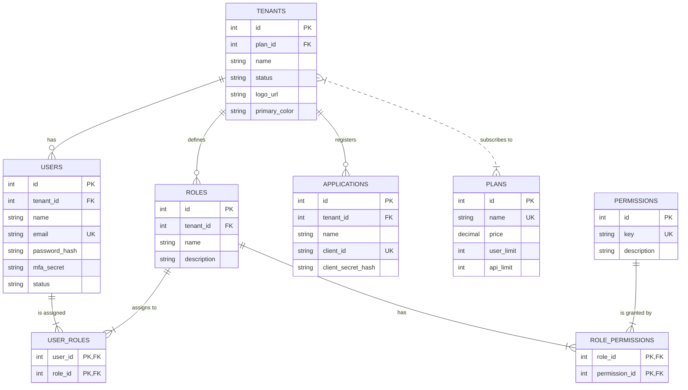

## **Tài liệu Đặc tả Kỹ thuật Chi tiết - Hệ thống IAM SaaS Đa khách hàng**

### **Giới thiệu**

Tài liệu này cung cấp đặc tả kỹ thuật chi tiết cho việc triển khai backend của hệ thống IAM SaaS. Mỗi chức năng sẽ được phân tích theo cấu trúc sau:
* **Mô tả Chức năng**: Tóm tắt mục tiêu của tính năng.
* **Luồng Logic Nghiệp vụ**: Các bước xử lý tuần tự từ phía backend.
* **Yêu cầu Dữ liệu (Input/Output)**: Dữ liệu đầu vào, đầu ra và các định dạng dự kiến.
* **Quy tắc Nghiệp vụ & Ràng buộc**: Các quy tắc cốt lõi, validation, và logic xử lý.
* **Xử lý Lỗi (Error Handling)**: Các trường hợp lỗi cụ thể và phản hồi mong muốn của hệ thống.
* **Yêu cầu Ghi Log (Audit Logging)**: Các sự kiện cần được ghi lại vào nhật ký kiểm tra.

---

### **Phần I: Chức năng Chung & Vai trò User**

#### **1.1. Chức năng: Đăng ký Tài khoản & Khởi tạo Tenant (`signup.html`)**

* **Mô tả Chức năng**: Cho phép người dùng mới đăng ký một tài khoản quản trị (Tenant Admin) và đồng thời tạo ra một Tenant mới trong hệ thống.
* **Luồng Logic Nghiệp vụ**:
    1.  Nhận yêu cầu `POST` từ client với thông tin đăng ký.
    2.  Validate dữ liệu đầu vào.
    3.  Kiểm tra sự tồn tại của email trong toàn bộ hệ thống.
    4.  Nếu hợp lệ, tạo một bản ghi `Tenant` mới với `status: pending_verification`.
    5.  Tạo một bản ghi `User` mới, liên kết với Tenant vừa tạo, gán vai trò `Tenant Admin`, và `status: pending_verification`. Mật khẩu phải được hash an toàn (ví dụ: bcrypt).
    6.  Tạo một token xác thực email duy nhất, có thời gian hết hạn (ví dụ: 24 giờ) và lưu nó, liên kết với User.
    7.  Gửi email đến người dùng chứa liên kết xác thực (có chứa token).
    8.  Trả về phản hồi thành công cho client.
* **Yêu cầu Dữ liệu**:
    * **Input**: `{ "name": "String", "email": "String (email format)", "password": "String (min 8 chars)", "tenantName": "String", "planId": "String/Int" }`
    * **Output (Success)**: `201 Created` - `{ "message": "Registration successful. Please check your email to verify your account." }`
* **Quy tắc Nghiệp vụ & Ràng buộc**:
    * Email phải là duy nhất trên toàn bộ hệ thống (`Users` table).
    * Tên Tenant (`tenantName`) không nhất thiết phải là duy nhất, nhưng có thể được kiểm tra để tránh trùng lặp quá rõ ràng.
    * Mật khẩu phải được hash trước khi lưu vào cơ sở dữ liệu.
* **Xử lý Lỗi**:
    * **400 Bad Request**: Dữ liệu không hợp lệ (email sai định dạng, password quá ngắn, thiếu trường). Phản hồi cần chỉ rõ lỗi ở trường nào.
    * **409 Conflict**: Email đã tồn tại trong hệ thống.
* **Yêu cầu Ghi Log**:
    * `EVENT: TENANT_SIGNUP_ATTEMPT`, `STATUS: SUCCESS/FAILURE`, `DETAILS: {email, tenantName, error_if_any}`, `LEVEL: INFO`.

#### **1.2. Chức năng: Xác thực Email (`verify-email.html`)**

* **Mô tả Chức năng**: Kích hoạt tài khoản User và Tenant sau khi người dùng nhấp vào liên kết xác thực.
* **Luồng Logic Nghiệp vụ**:
    1.  Nhận yêu cầu `GET` với token xác thực từ URL.
    2.  Tìm token trong cơ sở dữ liệu.
    3.  Nếu token tồn tại và chưa hết hạn:
        * Cập nhật `status` của User liên quan thành `active`.
        * Cập nhật `status` của Tenant liên quan thành `active`.
        * Đánh dấu token là đã sử dụng.
        * Trả về trang xác thực thành công.
    4.  Nếu token không tồn tại hoặc đã hết hạn, trả về trang lỗi.
* **Yêu cầu Dữ liệu**:
    * **Input**: URL Query Parameter `?token=<verification_token>`
    * **Output**: Trang HTML thông báo thành công hoặc thất bại.
* **Quy tắc Nghiệp vụ & Ràng buộc**:
    * Mỗi token chỉ được sử dụng một lần.
* **Xử lý Lỗi**:
    * Token không hợp lệ/hết hạn: Hiển thị thông báo lỗi và cung cấp tùy chọn "Gửi lại liên kết xác thực".
* **Yêu cầu Ghi Log**:
    * `EVENT: EMAIL_VERIFICATION`, `STATUS: SUCCESS/FAILURE`, `DETAILS: {userId, tenantId, reason_if_failure}`, `LEVEL: INFO`.

#### **1.3. Chức năng: Cập nhật Hồ sơ Cá nhân (`profile.html`)**

* **Mô tả Chức năng**: Cho phép người dùng đã đăng nhập tự cập nhật thông tin cá nhân.
* **Luồng Logic Nghiệp vụ**:
    1.  Nhận yêu cầu `PUT` tới endpoint `/api/v1/profile` với dữ liệu cần cập nhật.
    2.  Xác thực người dùng qua token (JWT).
    3.  Validate dữ liệu đầu vào (ví dụ: `name` không được trống).
    4.  Xử lý việc tải lên ảnh đại diện: lưu trữ tệp (ví dụ: S3), và cập nhật URL ảnh trong bản ghi User.
    5.  Cập nhật các trường thông tin tương ứng trong bản ghi User.
    6.  Trả về thông tin User đã được cập nhật.
* **Yêu cầu Dữ liệu**:
    * **Input**: `PUT /api/v1/profile` - `{ "name": "String" }` và `multipart/form-data` cho ảnh đại diện.
    * **Output (Success)**: `200 OK` - `{ "user": { ...updated_user_data } }`
* **Quy tắc Nghiệp vụ & Ràng buộc**:
    * Người dùng không được phép thay đổi email của họ.
    * Giới hạn kích thước và định dạng tệp ảnh đại diện.
* **Xử lý Lỗi**:
    * **400 Bad Request**: Dữ liệu không hợp lệ (tên trống, file ảnh quá lớn/sai định dạng).
    * **401 Unauthorized**: Người dùng chưa đăng nhập.
* **Yêu cầu Ghi Log**:
    * `EVENT: PROFILE_UPDATE`, `STATUS: SUCCESS`, `DETAILS: {userId, updated_fields: ['name', 'avatar']}`, `LEVEL: LOW`.

---

### **Phần II: Chức năng của Tenant Admin**

#### **2.1. Chức năng: Quản lý Người dùng (`users.html`)**

* **Mô tả Chức năng**: Cung cấp cho Tenant Admin các công cụ để quản lý vòng đời người dùng trong tenant của họ.
* **Luồng Logic Nghiệp vụ (Mời Người dùng)**:
    1.  Nhận yêu cầu `POST` tới `/api/v1/users/invite`.
    2.  Xác thực Tenant Admin.
    3.  Kiểm tra quota người dùng của tenant hiện tại so với giới hạn trong gói dịch vụ.
    4.  Validate dữ liệu đầu vào (email hợp lệ, `roleId` tồn tại).
    5.  Kiểm tra xem email đã tồn tại trong tenant chưa.
    6.  Tạo một bản ghi `User` mới với `status: pending_invitation`, liên kết với tenant và vai trò được chọn.
    7.  Tạo token mời duy nhất, có thời gian hết hạn (ví dụ: 48 giờ).
    8.  Gửi email mời đến địa chỉ email được cung cấp, chứa liên kết để chấp nhận lời mời.
* **Yêu cầu Dữ liệu (Mời Người dùng)**:
    * **Input**: `POST /api/v1/users/invite` - `{ "email": "String", "name": "String", "roleId": "Int" }`
    * **Output (Success)**: `201 Created` - `{ "message": "Invitation sent successfully." }`
* **Quy tắc Nghiệp vụ & Ràng buộc**:
    * Không thể mời người dùng nếu vượt quá quota của gói dịch vụ.
    * Email được mời phải là duy nhất trong phạm vi tenant.
* **Xử lý Lỗi**:
    * **403 Forbidden**: Vượt quá quota người dùng. Phản hồi cần có mã lỗi `QUOTA_EXCEEDED`.
    * **409 Conflict**: Email đã tồn tại trong tenant.
* **Yêu cầu Ghi Log**:
    * `EVENT: USER_INVITED`, `STATUS: SUCCESS`, `DETAILS: {adminId, invitedEmail, roleId}`, `LEVEL: MEDIUM`.
    * `EVENT: USER_INVITE_FAILED`, `STATUS: FAILURE`, `DETAILS: {adminId, invitedEmail, reason: 'QUOTA_EXCEEDED'}`, `LEVEL: WARNING`.

#### **2.2. Chức năng: Quản lý Vai trò và Quyền (`roles.html`, `permissions.html`)**

* **Mô tả Chức năng**: Cho phép Tenant Admin tạo ra các vai trò tùy chỉnh và gán các quyền cụ thể cho chúng.
* **Luồng Logic Nghiệp vụ (Tạo Vai trò)**:
    1.  Nhận yêu cầu `POST` tới `/api/v1/roles`.
    2.  Xác thực Tenant Admin.
    3.  Validate dữ liệu: `name` là bắt buộc, `permissionIds` phải là một mảng các ID quyền hợp lệ và tồn tại trong tenant.
    4.  Tạo một bản ghi `Role` mới.
    5.  Tạo các bản ghi liên kết trong bảng `Role_Permissions` để gán các quyền đã chọn cho vai trò mới.
* **Yêu cầu Dữ liệu (Tạo Vai trò)**:
    * **Input**: `POST /api/v1/roles` - `{ "name": "String", "description": "String", "icon": "String", "permissionIds": [1, 2, 3] }`
    * **Output (Success)**: `201 Created` - `{ "role": { ...new_role_data } }`
* **Quy tắc Nghiệp vụ & Ràng buộc**:
    * Tên vai trò (`name`) phải là duy nhất trong phạm vi tenant.
    * Khi xóa một vai trò, cần kiểm tra xem có người dùng nào đang được gán vai trò đó không. Nếu có, yêu cầu xác nhận và có thể yêu cầu gán một vai trò mới cho những người dùng đó.
* **Xử lý Lỗi**:
    * **400 Bad Request**: Tên vai trò đã tồn tại hoặc `permissionIds` không hợp lệ.
* **Yêu cầu Ghi Log**:
    * `EVENT: ROLE_CREATED`, `STATUS: SUCCESS`, `DETAILS: {adminId, roleId, roleName}`, `LEVEL: MEDIUM`.
    * `EVENT: ROLE_DELETED`, `STATUS: SUCCESS`, `DETAILS: {adminId, roleId, roleName}`, `LEVEL: HIGH`.

#### **2.3. Chức năng: Cấu hình Tích hợp SSO (`sso-integration.html`)**

* **Mô tả Chức năng**: Cho phép Tenant Admin cấu hình đăng nhập một lần (SSO) cho tenant của họ.
* **Luồng Logic Nghiệp vụ**:
    1.  Nhận yêu cầu `PUT` tới `/api/v1/sso-settings`.
    2.  Xác thực Tenant Admin.
    3.  Validate các trường dữ liệu (ví dụ: `metadataUrl` phải là URL hợp lệ).
    4.  Lưu trữ an toàn các thông tin nhạy cảm như `clientSecret` (sử dụng hệ thống quản lý secret).
    5.  Lưu cấu hình SSO cho tenant.
    6.  **Luồng "Kiểm tra kết nối"**: Thực hiện một yêu cầu mô phỏng đến IdP (nếu có thể) để xác minh cấu hình là đúng.
* **Yêu cầu Dữ liệu**:
    * **Input**: `PUT /api/v1/sso-settings` - `{ "provider": "SAML/OIDC", "enabled": true, "metadataUrl": "URL", "clientId": "String", "clientSecret": "String" }`
    * **Output (Success)**: `200 OK` - `{ "settings": { ...updated_sso_settings } }`
* **Quy tắc Nghiệp vụ & Ràng buộc**:
    * `clientSecret` không bao giờ được trả về trong các phản hồi API sau khi đã lưu.
* **Xử lý Lỗi**:
    * **400 Bad Request**: Dữ liệu cấu hình không hợp lệ.
* **Yêu cầu Ghi Log**:
    * `EVENT: SSO_CONFIG_UPDATED`, `STATUS: SUCCESS`, `DETAILS: {adminId, provider}`, `LEVEL: HIGH`.
    * `EVENT: SSO_CONNECTION_TEST`, `STATUS: SUCCESS/FAILURE`, `DETAILS: {adminId, reason_if_failure}`, `LEVEL: INFO`.

---

### **Phần III: Chức năng của Super Admin**

#### **3.1. Chức năng: Quản lý Gói dịch vụ (`plans.html`)**

* **Mô tả Chức năng**: Cung cấp cho Super Admin công cụ để tạo, sửa và quản lý các gói dịch vụ mà hệ thống cung cấp.
* **Luồng Logic Nghiệp vụ (Tạo Gói)**:
    1.  Nhận yêu cầu `POST` tới `/api/v1/sa/plans`.
    2.  Xác thực Super Admin.
    3.  Validate dữ liệu: `name` là bắt buộc, `price` và các giới hạn `quota` phải là số dương.
    4.  Tạo một bản ghi `Plan` mới trong cơ sở dữ liệu.
* **Yêu cầu Dữ liệu**:
    * **Input**: `POST /api/v1/sa/plans` - `{ "name": "String", "price": "Decimal", "userLimit": "Int", "apiLimit": "Int", "status": "active/inactive" }`
    * **Output (Success)**: `201 Created` - `{ "plan": { ...new_plan_data } }`
* **Quy tắc Nghiệp vụ & Ràng buộc**:
    * Tên gói (`name`) phải là duy nhất.
    * Không thể xóa một gói nếu có bất kỳ tenant nào đang đăng ký gói đó. Thay vào đó, gói nên được chuyển sang trạng thái `inactive`.
* **Xử lý Lỗi**:
    * **400 Bad Request**: Dữ liệu không hợp lệ.
* **Yêu cầu Ghi Log**:
    * `EVENT: PLAN_CREATED`, `STATUS: SUCCESS`, `DETAILS: {superAdminId, planId, planName}`, `LEVEL: MEDIUM`.
    * `EVENT: PLAN_UPDATED`, `STATUS: SUCCESS`, `DETAILS: {superAdminId, planId, updated_fields: [...] }`, `LEVEL: MEDIUM`.

#### **3.2. Chức năng: Phê duyệt Yêu cầu (`request-management.html`)**

* **Mô tả Chức năng**: Là trung tâm để Super Admin xem xét và hành động đối với các yêu cầu từ Tenant Admin.
* **Luồng Logic Nghiệp vụ (Phê duyệt Tăng Quota)**:
    1.  Nhận yêu cầu `POST` tới `/api/v1/sa/requests/{requestId}/approve`.
    2.  Xác thực Super Admin.
    3.  Tìm yêu cầu (`Request`) trong cơ sở dữ liệu.
    4.  Cập nhật giới hạn quota tương ứng trong bản ghi `Tenant`.
    5.  Cập nhật trạng thái của yêu cầu thành `approved`.
    6.  Gửi thông báo (email) đến Tenant Admin về việc yêu cầu đã được phê duyệt.
* **Yêu cầu Dữ liệu**:
    * **Input**: `POST /api/v1/sa/requests/{requestId}/approve` - (Không cần body)
    * **Input (Từ chối)**: `POST /api/v1/sa/requests/{requestId}/deny` - `{ "reason": "String" }`
    * **Output (Success)**: `200 OK` - `{ "message": "Request processed successfully." }`
* **Quy tắc Nghiệp vụ & Ràng buộc**:
    * Chỉ có thể xử lý các yêu cầu có trạng thái `pending`.
* **Xử lý Lỗi**:
    * **404 Not Found**: Không tìm thấy yêu cầu với ID đã cho.
* **Yêu cầu Ghi Log**:
    * `EVENT: QUOTA_REQUEST_PROCESSED`, `STATUS: APPROVED/DENIED`, `DETAILS: {superAdminId, requestId, tenantId, reason_if_denied}`, `LEVEL: MEDIUM`.

***

### **Phần IV: Đặc tả Kỹ thuật Chi tiết cho các Chức năng Giao diện Phức tạp**

Phần này tập trung vào các tính năng có sự tương tác giao diện người dùng (UI) phức tạp, đòi hỏi logic backend cụ thể để hỗ trợ.

#### **4.1. Chức năng: Tùy chỉnh Giao diện Tenant (`tenant-settings.html`)**

* **Mô tả Chức năng**: Cho phép Tenant Admin tùy chỉnh giao diện của các trang xác thực (đăng nhập, đăng ký) để phù hợp với thương hiệu của họ.
* **Luồng Logic Nghiệp vụ**:
    1.  Nhận yêu cầu `PUT` tới `/api/v1/tenant/branding`.
    2.  Xác thực Tenant Admin.
    3.  **Xử lý Logo**: Nếu có tệp logo mới được tải lên, hệ thống sẽ:
        * Validate tệp (kích thước < 2MB, định dạng PNG/JPG).
        * Lưu trữ tệp vào một dịch vụ lưu trữ file (ví dụ: AWS S3, Google Cloud Storage).
        * Lưu URL của tệp logo vào bản ghi `Tenant` trong cơ sở dữ liệu.
    4.  **Xử lý Màu chính**: Validate giá trị màu (`primaryColor`) là một mã màu hex hợp lệ (ví dụ: `#RRGGBB`).
    5.  Cập nhật các trường `logoUrl`, `primaryColor`, và `allowPublicSignup` trong bản ghi `Tenant`.
    6.  Trả về cấu hình branding đã được cập nhật.
* **Yêu cầu Dữ liệu**:
    * **Input**: `PUT /api/v1/tenant/branding` - `multipart/form-data` chứa `{ "primaryColor": "#4338ca", "allowPublicSignup": true }` và tệp `logoLogin`, `logoSignup`.
    * **Output (Success)**: `200 OK` - `{ "branding": { "logoUrl": "...", "primaryColor": "...", "allowPublicSignup": true } }`
* **Quy tắc Nghiệp vụ & Ràng buộc**:
    * Hệ thống cần cung cấp một endpoint công khai (ví dụ: `GET /api/v1/public/branding?tenantId=<tenant_id>`) để các trang đăng nhập có thể tải cấu hình branding này mà không cần xác thực.
    * Nếu `logoSignup` không được cung cấp, hệ thống sẽ mặc định sử dụng `logoLogin`.
* **Xử lý Lỗi**:
    * **400 Bad Request**: Tệp logo không hợp lệ, mã màu sai định dạng.
* **Yêu cầu Ghi Log**:
    * `EVENT: BRANDING_UPDATED`, `STATUS: SUCCESS`, `DETAILS: {adminId, tenantId, updated_fields: [...] }`, `LEVEL: MEDIUM`.

#### **4.2. Chức năng: Mô phỏng Chính sách Truy cập (`policy-simulator.html`)**

* **Mô tả Chức năng**: Cung cấp một công cụ cho Tenant Admin để kiểm tra xem một người dùng cụ thể có quyền thực hiện một hành động nhất định trong một ngữ cảnh cụ thể hay không.
* **Luồng Logic Nghiệp vụ**:
    1.  Nhận yêu cầu `POST` tới `/api/v1/policies/simulate`.
    2.  Xác thực Tenant Admin.
    3.  Dựa trên `userEmail`, truy vấn thông tin người dùng và các vai trò (`Roles`) được gán cho họ.
    4.  Tổng hợp tất cả các quyền (`Permissions`) từ các vai trò đó.
    5.  **Thực thi ABAC**: Lấy tất cả các chính sách (`Policies`) đang hoạt động trong tenant.
    6.  Lặp qua từng chính sách để kiểm tra xem có chính sách nào khớp với ngữ cảnh (`contextIp`, `contextTime`) và đối tượng (`userEmail`, vai trò) hay không.
    7.  **Quyết định cuối cùng**:
        * Đầu tiên, kiểm tra xem người dùng có quyền thực hiện hành động (`actionKey`) thông qua RBAC hay không.
        * Nếu có quyền, tiếp tục kiểm tra các chính sách ABAC. Nếu có bất kỳ chính sách `DENY` nào khớp, kết quả cuối cùng là **TỪ CHỐI**.
        * Nếu không có chính sách `DENY` nào, kết quả là **CHO PHÉP**.
    8.  Trả về kết quả phân tích chi tiết, bao gồm lý do cho quyết định.
* **Yêu cầu Dữ liệu**:
    * **Input**: `POST /api/v1/policies/simulate` - `{ "userEmail": "String", "actionKey": "String", "contextIp": "String (optional)", "contextTime": "String (optional)" }`
    * **Output (Success)**: `200 OK` - `{ "decision": "ALLOWED/DENIED", "reason": "String", "matchedPolicy": "String (optional)", "matchedRole": "String (optional)" }`
* **Quy tắc Nghiệp vụ & Ràng buộc**:
    * Chính sách `DENY` luôn có độ ưu tiên cao hơn `ALLOW`.
    * Mô phỏng phải phản ánh chính xác logic của engine phân quyền thực tế.
* **Xử lý Lỗi**:
    * **404 Not Found**: Không tìm thấy người dùng với email đã cho.
* **Yêu cầu Ghi Log**:
    * `EVENT: POLICY_SIMULATION_RUN`, `STATUS: SUCCESS`, `DETAILS: {adminId, simulatedUserEmail, actionKey, result}`, `LEVEL: LOW`.

---

### **Phần V: Các Vấn đề Xuyên suốt (Cross-Cutting Concerns)**

#### **5.1. Xác thực và Quản lý Phiên**

* **Cấu trúc JWT (JSON Web Token)**:
    * **Access Token (Hết hạn ngắn, ví dụ: 15 phút)**:
        * Payload: `{ "sub": "userId", "tid": "tenantId", "roles": ["roleId1", ...], "exp": "timestamp" }`
    * **Refresh Token (Hết hạn dài, ví dụ: 7 ngày)**:
        * Là một chuỗi ngẫu nhiên, không chứa thông tin, được lưu trong cơ sở dữ liệu và liên kết với User.
* **Luồng Refresh Token**:
    1.  Khi Access Token hết hạn, client gửi Refresh Token đến endpoint `/api/v1/auth/refresh`.
    2.  Backend xác thực Refresh Token trong cơ sở dữ liệu, kiểm tra xem nó có hợp lệ và chưa bị thu hồi không.
    3.  Nếu hợp lệ, backend tạo ra một cặp Access Token và Refresh Token mới, thu hồi Refresh Token cũ, và trả về cặp token mới cho client.
* **Thu hồi Phiên (`session-management.html`)**:
    * Khi Tenant Admin/Super Admin thu hồi một phiên, backend sẽ thu hồi (vô hiệu hóa) Refresh Token tương ứng trong cơ sở dữ liệu. Điều này sẽ ngăn người dùng lấy Access Token mới, buộc họ phải đăng nhập lại.

#### **5.2. Engine Phân quyền (Authorization Engine)**

* Đây là một service hoặc module trung tâm chịu trách nhiệm kiểm tra quyền truy cập cho mọi yêu cầu API.
* **Luồng kiểm tra**:
    1.  API Gateway hoặc một middleware sẽ trích xuất thông tin `userId`, `tenantId`, và `roles` từ JWT của mỗi yêu cầu.
    2.  Trước khi thực thi logic của endpoint, middleware sẽ gọi đến Authorization Engine với các thông tin: `userId`, `tenantId`, `requiredPermission` (ví dụ: `users:create`), và các thuộc tính ngữ cảnh (IP, thời gian).
    3.  Engine sẽ thực hiện logic kiểm tra RBAC và ABAC tương tự như luồng mô phỏng.
    4.  Nếu kết quả là `DENIED`, yêu cầu sẽ bị từ chối với mã lỗi `403 Forbidden`.

#### **5.3. Dịch vụ Ghi Log Kiểm tra (Audit Logging Service)**

* **Cấu trúc Log Event**: Mỗi bản ghi log nên có cấu trúc nhất quán để dễ dàng truy vấn và phân tích.
    * `{ "timestamp": "ISO_8601_DateTime", "tenantId": "String", "actor": { "userId": "String", "userEmail": "String", "ipAddress": "String" }, "event": "String" (e.g., USER_LOGIN_SUCCESS), "status": "SUCCESS/FAILURE", "severity": "LOW/MEDIUM/HIGH/CRITICAL", "details": { ...event_specific_data } }`
* **Triển khai**:
    * Các microservices sẽ không ghi log trực tiếp vào cơ sở dữ liệu. Thay vào đó, chúng sẽ gửi các sự kiện log đến một **Message Broker** (ví dụ: Kafka, RabbitMQ).
    * Một **Audit Service** riêng biệt sẽ lắng nghe các sự kiện từ Message Broker và ghi chúng vào một cơ sở dữ liệu được tối ưu cho việc tìm kiếm (ví dụ: Elasticsearch).

#### **5.4. Dịch vụ Thông báo (Notification Service)**

* Đây là một dịch vụ trung tâm chịu trách nhiệm gửi tất cả các loại thông báo (email, SMS, push notification).
* **Luồng gửi Email**:
    1.  Một service khác (ví dụ: Identity Service) cần gửi email (ví dụ: email xác thực).
    2.  Service đó sẽ gửi một thông điệp đến Message Broker với các thông tin cần thiết: `{ "type": "email", "template": "verify_email_template", "recipient": "user@example.com", "data": { "verificationLink": "..." } }`.
    3.  Notification Service sẽ nhận thông điệp, render template email với dữ liệu được cung cấp, và gửi email thông qua một nhà cung cấp dịch vụ email (ví dụ: AWS SES, SendGrid).
* **Các Template cần thiết**:
    * Chào mừng & Xác thực Email.
    * Đặt lại Mật khẩu.
    * Lời mời tham gia Tenant.
    * Thông báo bật/tắt MFA.
    * Cảnh báo bảo mật (ví dụ: phát hiện đăng nhập bất thường).
    * Thông báo về thanh toán (thành công, thất bại).

-----

### **Phần VI: Yêu cầu Phi chức năng (Non-Functional Requirements)**

Phần này định nghĩa các tiêu chuẩn về hiệu suất, độ tin cậy, và khả năng mở rộng của hệ thống.

#### **6.1. Hiệu suất (Performance)**

  * **Thời gian Phản hồi API**:
      * Các API xác thực (login, token refresh): `< 200ms` ở phân vị thứ 95.
      * Các API CRUD (Create, Read, Update, Delete) thông thường: `< 500ms` ở phân vị thứ 95.
      * Các API truy vấn phức tạp (báo cáo, audit log): `< 2s` ở phân vị thứ 95.
  * **Khả năng chịu tải**:
      * Hệ thống phải có khả năng xử lý **10,000 yêu cầu mỗi giây (RPS)** ở mức tải thông thường.
      * Hỗ trợ đồng thời **1 triệu người dùng** đang hoạt động trên toàn bộ các tenant.

#### **6.2. Độ tin cậy và Tính sẵn sàng cao (Reliability & High Availability)**

  * **Uptime SLA**: Cam kết thời gian hoạt động của hệ thống là **99.9%** (tương đương không quá 43 phút downtime mỗi tháng).
  * **Triển khai Đa vùng (Multi-Region Deployment)**:
      * Hệ thống phải được triển khai trên ít nhất hai vùng địa lý khác nhau (ví dụ: `us-east-1` và `ap-southeast-1`) trên các nhà cung cấp đám mây (AWS, GCP, Azure).
      * Sử dụng cơ sở dữ liệu có khả năng sao chép đa vùng (cross-region replication) để đảm bảo tính sẵn sàng của dữ liệu.
      * Sử dụng **Message Broker (Kafka)** để đồng bộ dữ liệu và sự kiện giữa các vùng một cách bất đồng bộ.
  * **Không có Điểm lỗi Duy nhất (No Single Point of Failure - SPOF)**: Mọi thành phần của hệ thống (API Gateway, microservices, cơ sở dữ liệu) đều phải được triển khai với cơ chế dự phòng (redundancy).

#### **6.3. Khả năng Mở rộng (Scalability)**

  * **Mở rộng Ngang (Horizontal Scaling)**: Các microservices phải được thiết kế để có thể dễ dàng tăng số lượng instance (pods trong Kubernetes) để đáp ứng tải tăng đột biến.
  * **Tự động Mở rộng (Auto-scaling)**: Cấu hình cơ chế tự động mở rộng dựa trên các chỉ số như CPU/RAM utilization hoặc số lượng yêu cầu mỗi giây.

-----

### **Phần VII: Quản lý Dữ liệu và Tuân thủ (Data Management & Compliance)**

#### **7.1. Cách ly Dữ liệu Tenant (Data Isolation)**

  * **Mức Logic**: Mỗi bản ghi trong các bảng chính (ví dụ: `Users`, `Roles`, `Applications`) phải chứa một cột `tenant_id`. Tất cả các câu truy vấn cơ sở dữ liệu **bắt buộc** phải lọc theo `tenant_id` của người dùng đang thực hiện yêu cầu để ngăn chặn rò rỉ dữ liệu giữa các tenant.
  * **Tùy chọn Mức Vật lý**: Đối với các khách hàng Enterprise, hệ thống có thể cung cấp tùy chọn triển khai trên một cơ sở dữ liệu hoặc một cụm hạ tầng hoàn toàn riêng biệt để đạt được mức độ cách ly cao nhất.

#### **7.2. Sao lưu và Khôi phục (Backup & Recovery)**

  * **Sao lưu Tự động**: Cấu hình sao lưu cơ sở dữ liệu tự động hàng ngày.
  * **Lưu giữ Bản sao lưu**: Các bản sao lưu phải được lưu giữ trong ít nhất **30 ngày**.
  * **Point-in-Time Recovery (PITR)**: Kích hoạt tính năng PITR để có thể khôi phục dữ liệu về bất kỳ thời điểm nào trong khoảng thời gian lưu giữ.
  * **Quy trình Khôi phục**: Phải có tài liệu và kịch bản (runbook) chi tiết cho việc khôi phục dữ liệu trong trường hợp xảy ra sự cố.

#### **7.3. Tuân thủ GDPR - Yêu cầu Xóa Dữ liệu**

  * **Luồng Xóa Dữ liệu**:
    1.  Người dùng gửi yêu cầu xóa dữ liệu qua ticket hỗ trợ (`support.html`).
    2.  Tenant Admin nhận ticket và có thể xác minh yêu cầu.
    3.  Tenant Admin thực hiện hành động xóa người dùng từ `users.html`.
    4.  Backend nhận yêu cầu xóa và thực hiện "xóa mềm" (soft delete) bản ghi `User` bằng cách đánh dấu `is_deleted = true`.
    5.  Sau một khoảng thời gian ân hạn (ví dụ: 7 ngày), một cron job sẽ tự động thực hiện "xóa cứng" (hard delete) hoặc ẩn danh hóa (anonymize) dữ liệu người dùng để tuân thủ quyền được lãng quên.
  * **Ẩn danh hóa (Anonymization)**: Đối với các bản ghi liên quan như `audit_logs`, thông tin định danh cá nhân (PII) của người dùng bị xóa (ví dụ: `userEmail`) sẽ được thay thế bằng một giá trị ẩn danh (ví dụ: `anonymized_user_xxxxxxxx`).

-----

### **Phần VIII: Phụ lục - Đặc tả API Endpoints Chi tiết**

Đây là ví dụ chi tiết cho một vài endpoints quan trọng.

#### **8.1. Endpoint: `POST /api/v1/auth/login`**

  * **Mô tả**: Xác thực người dùng và trả về cặp Access/Refresh Token.
  * **Request Body**:
    ```json
    {
      "email": "user@example.com",
      "password": "user_password",
      "mfa_otp": "123456" // (Tùy chọn, chỉ cần nếu người dùng đã bật MFA)
    }
    ```
  * **Response (Success)**: `200 OK`
    ```json
    {
      "accessToken": "eyJhbGciOiJI...",
      "refreshToken": "aBcDeFgHiJkL...",
      "expiresIn": 900 // (Thời gian hết hạn của accessToken tính bằng giây)
    }
    ```
  * **Response (Lỗi)**:
      * `401 Unauthorized`: Sai email hoặc mật khẩu.
        ```json
        { "error": "INVALID_CREDENTIALS", "message": "Invalid email or password." }
        ```
      * `400 Bad Request`: Yêu cầu MFA nhưng không cung cấp OTP.
        ```json
        { "error": "MFA_REQUIRED", "message": "MFA one-time password is required." }
        ```
      * `401 Unauthorized`: Sai mã OTP.
        ```json
        { "error": "INVALID_MFA_OTP", "message": "Invalid MFA one-time password." }
        ```

#### **8.2. Endpoint: `GET /api/v1/users` (Dành cho Tenant Admin)**

  * **Mô tả**: Lấy danh sách người dùng trong tenant với khả năng lọc và phân trang.
  * **Query Parameters**:
      * `?page=1`: Số trang.
      * `?limit=20`: Số lượng bản ghi mỗi trang.
      * `?status=active`: Lọc theo trạng thái (`active`, `pending`).
      * `?roleId=5`: Lọc theo vai trò.
      * `?search=john`: Tìm kiếm theo tên hoặc email.
  * **Response (Success)**: `200 OK`
    ```json
    {
      "pagination": {
        "currentPage": 1,
        "totalPages": 5,
        "totalItems": 98
      },
      "users": [
        {
          "id": 1,
          "name": "John Doe",
          "email": "john.doe@example.com",
          "role": { "id": 5, "name": "Editor" },
          "status": "active"
        },
        // ... more users
      ]
    }
    ```
  * **Response (Lỗi)**:
      * `403 Forbidden`: Người dùng không có quyền `users:read`.

-----

### **Phần X: Chiến lược Triển khai và Vận hành (Deployment & CI/CD)**

Phần này mô tả quy trình đề xuất để xây dựng, kiểm thử và triển khai hệ thống một cách tự động và an toàn.

#### **10.1. Cấu trúc Môi trường (Environment Structure)**

Hệ thống sẽ được triển khai trên ba môi trường chính để đảm bảo chất lượng:

1.  **Development (Dev)**: Môi trường dành cho lập trình viên, tích hợp liên tục các thay đổi mới nhất. Dữ liệu có thể được làm mới thường xuyên.
2.  **Staging (Staging/UAT)**: Môi trường ổn định, là bản sao gần nhất của Production. Dùng để kiểm thử tích hợp (Integration Testing), kiểm thử chấp nhận người dùng (UAT), và kiểm thử hiệu năng.
3.  **Production (Prod)**: Môi trường chính thức cho khách hàng sử dụng. Chỉ có các phiên bản đã được kiểm thử kỹ lưỡng mới được triển khai lên đây.

#### **10.2. Quy trình Tích hợp và Triển khai Liên tục (CI/CD Pipeline)**

Quy trình CI/CD sẽ được tự động hóa hoàn toàn:

1.  **Commit Code**: Lập trình viên đẩy mã nguồn lên một nhánh tính năng (feature branch) trên Git (ví dụ: GitLab, GitHub).
2.  **Merge Request**: Tạo một yêu cầu hợp nhất (Merge Request/Pull Request) vào nhánh `develop`.
3.  **CI Pipeline Trigger**:
      * **Build**: Tự động xây dựng (build) các microservices và đóng gói thành các Docker image.
      * **Unit & Integration Tests**: Chạy các bộ kiểm thử tự động. Nếu thất bại, pipeline sẽ dừng và thông báo cho đội ngũ.
      * **Code Analysis**: Quét mã nguồn để kiểm tra chất lượng và các lỗ hổng bảo mật (ví dụ: SonarQube).
4.  **Deploy to Dev**: Nếu CI thành công, các thay đổi sẽ được hợp nhất vào nhánh `develop` và tự động triển khai lên môi trường Dev.
5.  **Deploy to Staging**: Khi một phiên bản đã sẵn sàng để kiểm thử, một tag sẽ được tạo từ nhánh `develop` (ví dụ: `v1.1.0-rc1`) và triển khai lên môi trường Staging.
6.  **Deploy to Production**: Sau khi được phê duyệt, phiên bản từ Staging sẽ được hợp nhất vào nhánh `main`/`master` và triển khai lên Production bằng chiến lược **Blue-Green** hoặc **Canary**.
      * **Blue-Green Deployment**: Triển khai phiên bản mới ("Green") song song với phiên bản cũ ("Blue"). Sau khi xác nhận phiên bản mới hoạt động ổn định, traffic sẽ được chuyển hoàn toàn sang "Green".
      * **Canary Deployment**: Dần dần chuyển một phần nhỏ traffic (ví dụ: 1%, 10%) sang phiên bản mới để theo dõi hiệu suất và lỗi trước khi chuyển 100% traffic.

-----

### **Phần XI: Giám sát, Ghi Log và Cảnh báo (Monitoring, Logging & Alerting)**

#### **11.1. Chiến lược Ghi Log Tập trung (Centralized Logging)**

  * **Structured Logging**: Tất cả các microservices phải ghi log theo định dạng JSON có cấu trúc để dễ dàng phân tích và truy vấn.
  * **Log Aggregation**: Logs từ tất cả các services sẽ được thu thập và đẩy về một hệ thống quản lý log tập trung như **Elasticsearch (ELK Stack)** hoặc **Splunk**.
  * **Correlation ID**: Mọi yêu cầu đi vào hệ thống qua API Gateway sẽ được gán một `Correlation ID` duy nhất. ID này sẽ được truyền qua tất cả các microservices mà yêu cầu đó đi qua, giúp việc truy vết (tracing) một luồng xử lý trở nên dễ dàng.

#### **11.2. Giám sát Hệ thống (System Monitoring)**

Sử dụng các công cụ như **Prometheus** và **Grafana** để theo dõi các chỉ số quan trọng (metrics) của hệ thống.

  * **Chỉ số Vàng (Golden Signals)**:
      * **Latency**: Thời gian phản hồi của các API endpoint.
      * **Traffic**: Số lượng yêu cầu mỗi giây (RPS).
      * **Errors**: Tỷ lệ lỗi (HTTP 5xx, 4xx).
      * **Saturation**: Mức độ sử dụng tài nguyên (CPU, RAM, Disk I/O).
  * **Business Metrics**: Theo dõi các chỉ số nghiệp vụ quan trọng như số lượng người dùng đăng ký mới, số lượng đăng nhập thành công, số lượng tenant đang hoạt động.

#### **11.3. Cảnh báo (Alerting)**

Cấu hình các quy tắc cảnh báo tự động trong **Alertmanager** (tích hợp với Prometheus) để thông báo cho đội ngũ vận hành qua các kênh như Slack, PagerDuty, hoặc Email.

  * **Ví dụ về Quy tắc Cảnh báo**:
      * `CRITICAL`: Tỷ lệ lỗi HTTP 5xx của Authentication Service \> 5% trong 5 phút.
      * `WARNING`: Mức sử dụng CPU của một service \> 80% trong 15 phút.
      * `INFO`: Một tenant vừa nâng cấp lên gói Enterprise.

-----

### **Phần XII: Quản lý Phiên bản API (API Versioning)**

  * **Chiến lược**: Sử dụng phương pháp **URL Versioning** để quản lý các phiên bản API. Đây là cách tiếp cận rõ ràng và phổ biến nhất.
      * Ví dụ: `https://api.iamsaas.com/api/v1/users`, `https://api.iamsaas.com/api/v2/users`
  * **Quy tắc**:
      * Khi có một thay đổi gây phá vỡ (breaking change) đối với một endpoint (ví dụ: thay đổi cấu trúc response, xóa một trường), một phiên bản API mới (`v2`, `v3`) sẽ được tạo ra.
      * Phiên bản cũ sẽ được duy trì trong một khoảng thời gian nhất định (deprecated period) và có thông báo rõ ràng cho khách hàng về lộ trình ngừng hỗ trợ.
      * Các thay đổi không gây phá vỡ (ví dụ: thêm một trường mới vào response) có thể được áp dụng trên phiên bản API hiện tại.

-----

### **Phụ lục A: Sơ đồ Cơ sở dữ liệu (Conceptual Schema)**

*Đây là sơ đồ khái niệm, không phải là thiết kế cuối cùng.*



-----

### **Phụ lục B: Thuật ngữ (Glossary)**

  * **IAM (Identity and Access Management)**: Quản lý Định danh và Truy cập - một khuôn khổ các chính sách và công nghệ để đảm bảo người dùng phù hợp có quyền truy cập phù hợp vào các tài nguyên công nghệ.
  * **Tenant**: Một khách hàng hoặc một tổ chức sử dụng dịch vụ, hoạt động trong một môi trường logic được cách ly với các khách hàng khác.
  * **SSO (Single Sign-On)**: Đăng nhập một lần - cho phép người dùng đăng nhập một lần bằng một bộ thông tin xác thực để truy cập vào nhiều ứng dụng.
  * **MFA (Multi-Factor Authentication)**: Xác thực Đa yếu tố - một phương pháp bảo mật yêu cầu người dùng cung cấp hai hoặc nhiều yếu tố xác minh để được cấp quyền truy cập.
  * **RBAC (Role-Based Access Control)**: Kiểm soát Truy cập Dựa trên Vai trò - cấp quyền truy cập dựa trên vai trò của các cá nhân trong một tổ chức.
  * **ABAC (Attribute-Based Access Control)**: Kiểm soát Truy cập Dựa trên Thuộc tính - một mô hình phân quyền động, cấp quyền dựa trên sự kết hợp của các thuộc tính của người dùng, tài nguyên và môi trường.
  * **SCIM (System for Cross-domain Identity Management)**: Một tiêu chuẩn mở để tự động hóa việc trao đổi thông tin nhận dạng người dùng giữa các miền danh tính hoặc các hệ thống CNTT.
  * **JWT (JSON Web Token)**: Một tiêu chuẩn mở để tạo ra các token truy cập dựa trên JSON, được sử dụng để truyền thông tin an toàn giữa các bên.